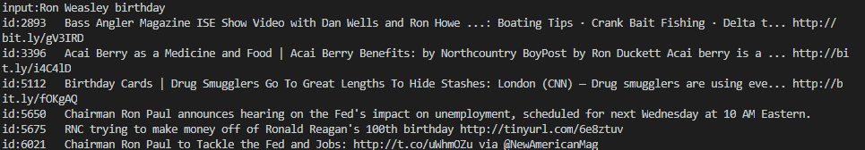
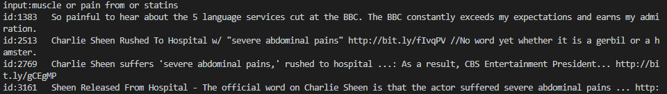
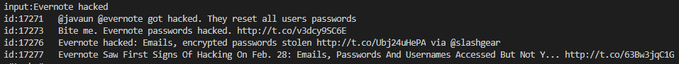
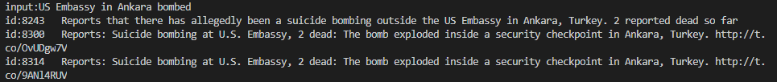
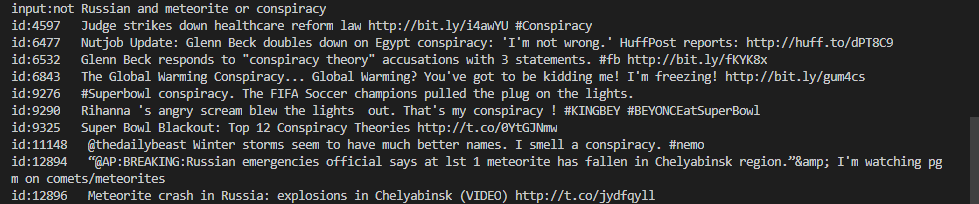
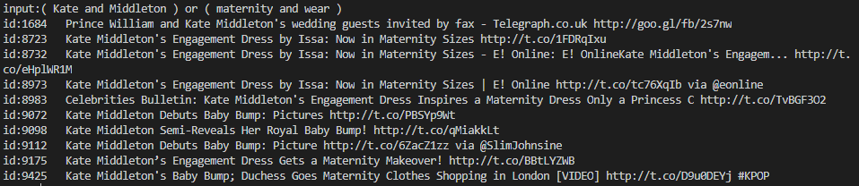

## 实验目的
1. 在tweets的数据集上构建倒排索引
2. 实现布尔查询,支持 and,or ,not

## 实验过程

首先对数据集进行处理,所给的数据集是json的形式,所以很容易的在每一条tweet中提取出text的部分并进行处理,使用字典建立倒排索引,其中字典的key为处理后的单词,字典的值为单词的所在的tweet id,另外使用一个字典来存储单词的倒排索引的长度,用于以后的优化

## 布尔查询处理

对于单独的and,or,not以及多个and,多个or等只含有单一连接词的查询语句,采取直接的方式,根据单词的所在的tweet个数进行排序,首先对包含的tweet数小的进行合并

对于同时含有and,or,not的混合查询,以及包含括号的混合查询,使用一个栈来保存出现的连接词-连接词栈,使用另外一个栈来保存tweet列表-列表栈,当处理到一个新的词时,如果该词是单词,则将该单词所在的列表直接加入到列表栈中,如果该词是连接词,则判断它与连接词栈栈顶的连接词的优先级,如果该词的优先级高于栈顶的优先级,则直接将该词压入栈顶,如果该词的优先级低于栈顶的优先级,则将栈顶元素抛出,计算新的列表,再将该词压入栈,当出现括号时,如果括号是左括号,则直接入连接词栈,如果括号是右括号,则将左括号之前的所有连接词抛出并将计算结果压入列表栈中
列表栈中的最后一个元素就是该次查询的结果

### 部分实验结果展示

