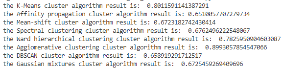

# Clustering with sklearn

## 实验目标

1. 测试sklearn中以下聚类算法在tweets数据集上的聚类效果
2. 使用NMI(Normalized Mutual Information)作为评价指标

## 实验过程

首先根据所给的tweets数据集,得到text内容和cluster内容,利用sklearn中的库计算得到tfidf,使用聚类方法进行聚类
使用NMI对聚类效果进行比较.

### NMI 归一化互信息

$NMI(Y,C)=\frac{2I(Y,C)}{H(Y)+H(C)}$
Y:class labels
C: cluster labels
H(.): entropy
I(Y,C): Mutual Information b/w and C

## 实验结果

